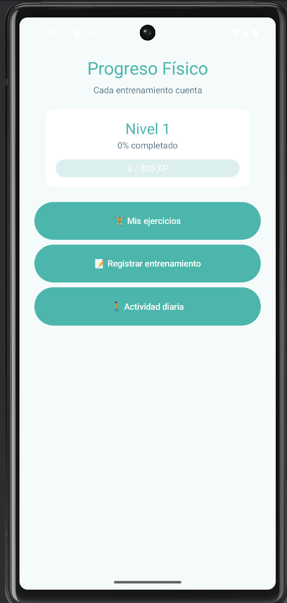
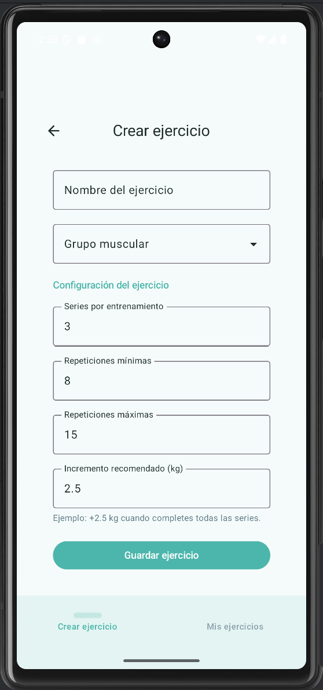
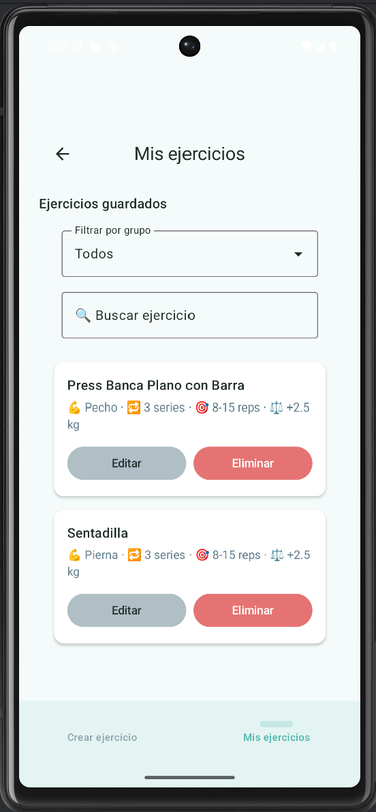
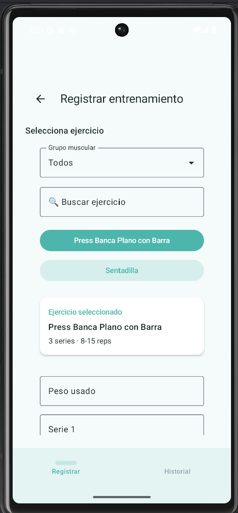
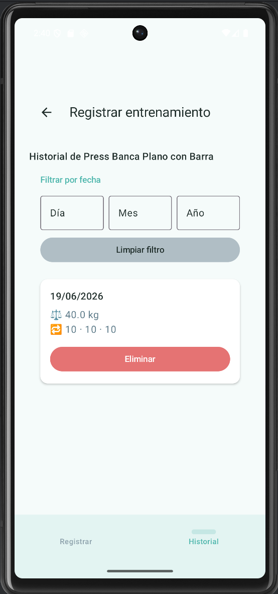
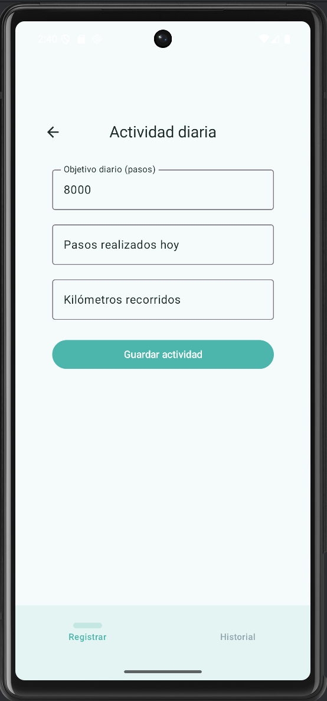
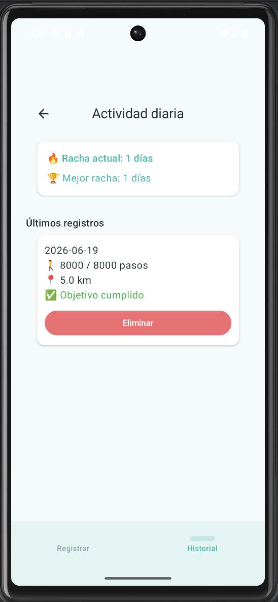

# Progreso Físico

Aplicación Android desarrollada para registrar entrenamientos, actividad diaria y visualizar la evolución física del usuario.

El objetivo del proyecto es ofrecer una herramienta sencilla para hacer seguimiento del progreso deportivo mediante un sistema de experiencia, niveles y estadísticas.

## Características principales

* Sistema de niveles del 1 al 100.
* Gestión completa de ejercicios.
* Registro de entrenamientos por ejercicio.
* Historial de entrenamientos.
* Recomendación automática de progresión.
* Registro de actividad diaria.
* Historial de actividad.
* Sistema de rachas.
* Ganancia y pérdida de experiencia.
* Prevención de XP duplicada.
* Estados vacíos y confirmaciones mediante diálogos.

## Tecnologías utilizadas

* Kotlin
* Jetpack Compose
* Room
* MVVM
* Repository Pattern
* Material 3
* Navigation Compose
* ViewModels con Factories

## Arquitectura

La aplicación sigue una arquitectura MVVM junto con Repository Pattern para separar responsabilidades y facilitar la escalabilidad y el mantenimiento.

```text
UI (Jetpack Compose)
        ↓
ViewModel
        ↓
Repository
        ↓
Room Database
```

## Capturas de pantalla

### Inicio



### Crear ejercicios



### Mis ejercicios



### Registrar entrenamiento



### Historial de entrenamientos



### Registrar actividad diaria



### Historial de actividad



## Cómo ejecutar el proyecto

1. Clona el repositorio.

```bash
git clone https://github.com/JulioJ2345/progreso-fisico-android.git
```

2. Abre el proyecto con Android Studio.

3. Sincroniza Gradle.

4. Ejecuta la aplicación en un emulador o dispositivo físico.

## Aprendizajes

Durante el desarrollo de este proyecto se han aplicado conceptos como:

* Arquitectura MVVM.
* Persistencia local con Room.
* Gestión del estado con Jetpack Compose.
* Navegación entre pantallas.
* Diseño de interfaces con Material 3.
* Organización del código mediante Repository Pattern.
* Control de experiencia y lógica de negocio.

## Autor

Julio Rodiño.
